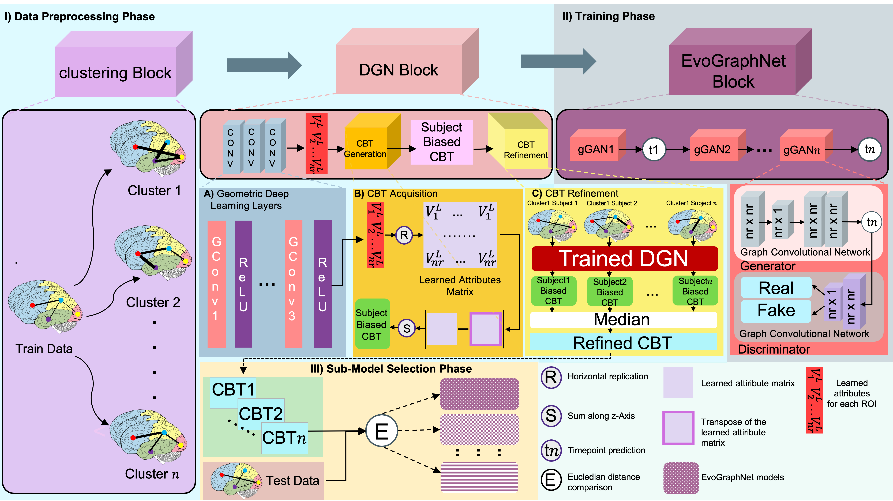
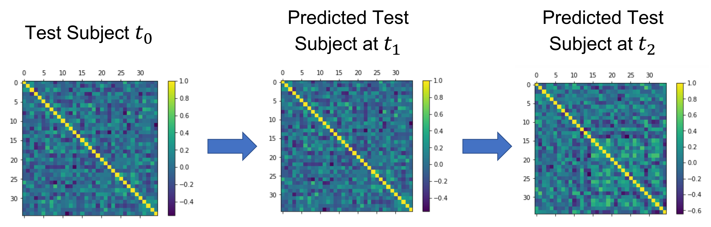

# Few-shot LeArning Training Net-work (FLAT-Net)

How to accurately and efficiently predict brain graph evolution over time with small set of training examples?

Please contact gurisozen@gmail.com for inquiries. Thank you. 



# Introduction
This work is accepted at the the PRIME-MICCAI 2021 workshop.
> **FLAT-Net: Longitudinal Brain Graph Evolution Prediction from a Few Training Representative Templates**<br/>
> Guris Özen<sup>1</sup>,Ahmed Nebli<sup>1,2</sup>,[Islem Rekik](https://basira-lab.com/)<sup>1</sup><br/>
> <sup>1</sup>BASIRA Lab, Faculty of Computer and Informatics, Istanbul Technical University, Istanbul, Turkey<br/>
> <sup>2</sup>National School for Computer Science (ENSI), Mannouba, Tunisia<br/>

>
> **Abstract:** *Diagnosing brain dysconnectivity disorders at an early stage amounts to understanding the evolution of such abnormal connectivities over time. Ideally, without resorting to collecting more connectomic data over time, one would predict the disease evolution with high accuracy. At this point, generative learning models from limited data can come into play to predict brain connectomic evolution over time from a single acquisition timepoint. Here, we aim to bridge the gap between data scarcity and brain connectomic evolution prediction by proposing our novel Few-shot LeArning Training Network (FLAT-Net), the first framework leveraging the few-shot learning paradigm for brain connectivity evolution prediction from baseline timepoint. To do so, we introduce the concept of learning from representative connectional brain templates (CBTs), which encode the most centered and representative features (i.e., connectivities) for a given population of brain networks. Such CBTs capture well the data heterogeneity and diversity, hence they can train our predictive model in a frugal but generalizable manner. More specifically, our FLAT-Net starts by clustering the data into k clusters using the renowned K-means method. Then, for each cluster of homogenous brain networks, we create a CBT, which we call cluster specific-CBT (cs-CBT).  We solely use each cs-CBT to train a distinct geometric generative adversarial network (gGAN) (i.e., for k clusters, we extract k cs-CBTs, and we train k gGANs (sub-model) each for a distinct cs-CBT) to learn the cs-CBT evolution over time. At the testing stage, we compute the Euclidean distance between the testing subject and each cs-CBT, and we select the gGAN model trained on the closest cs-CBT to the testing subject for prediction. A series of benchmarks against variants and excised interpretations of our framework showed that the proposed FLAT-Net, training strategy, and sub-model selection are promising strategies for predicting longitudinal brain alterations from only a few representative templates.*


## Code
This code was implemented using Python 3.8 (Anaconda) on Windows 10.

## Installation
### *Anaconda Installation*
* Go to  https://www.anaconda.com/products/individual
* Download version for your system (We used Python 3.8  on 64bit Windows 10 )
* Install the platform
* Create a conda environment by typing:  ```conda create –n FLAT-Net pip python=3.8 ```

### *Dependency Installation*
Copy and paste following commands to install all packages (CPU version)
```sh
$ conda activate FLAT-Net
$ conda install pytorch==1.4.0 torchvision==0.5.0 cpuonly -c pytorch
$ pip install scikit-learn
$ pip install matplotlib
$ pip install torch-scatter==latest+cpu -f https://pytorch-geometric.com/whl/torch-1.4.0.html
$ pip install torch-sparse==latest+cpu -f https://pytorch-geometric.com/whl/torch-1.4.0.html
$ pip install torch-cluster==latest+cpu -f https://pytorch-geometric.com/whl/torch-1.4.0.html
$ pip install torch-spline-conv==latest+cpu -f https://pytorch-geometric.com/whl/torch-1.4.0.html
$ pip install torch-geometric
$ pip install networkx

```
This is all for CPU installation, please visit (optional) PyTorch-Geometric’s web page (https://pytorch-geometric.readthedocs.io/en/latest/notes/installation.html) for description on installing GPU version. Code will check the version of dependencies and availability of GPU. If everything is configured correctly, it will utilize GPU automatically.
 

## Run FLAT-Net
To run our code, open up a terminal at FLAT-Net's directory and type in
```sh
$ conda activate FLAT-Net 
$ python demo.py
```
Commandline Arguments:

--subject_number': Subject numbers to be generated  
--cluster_num': Total cluster number (k)  
--folds_evo: Total fold number for EvoGraphNet  
--folds_sDGN: Total fold number for sDGN  
--folds_main:  Total fold number for main  
--epochs_evo: Total epoch number for EvoGraphNet  
--epochs_sDGN: Total epoch number for sDG.    
#####  You may edit EvoGraphNet.py, config.py and datautils.py to tune hyperparameters, configure training or supply your own dataset.

## Components of DGN’s Code
| Component | Content |
| ------ | ------ |
| demo.py| Driver code that implements data simulation, cross-validation, preprocessing, training, and testing functions. |
| simulate_data.py | Implementation of simulating data subjects for experiments. |
| preprocessing.py | Implementation of clustering and production of cluster-specific CBTs. |
| config.py | Includes hyperparameter and other options for sDGN. You may modify it according to your needs. |
| helper.py| Includes some helper functions for sDGN. |
| SDGN.py | Implementation of the sDGN model. |
| train.py | Implementation of the EvoGraphNet sub-model training with cluster-specific CBTs. |
| datautils.py | Implementation of data operations for training of EvoGraphNet sub-models. |
| modelEvoGraphNet.py | Implementation of the EvoGraphNet model. |
| EvoGraphNet.py | Implementation of training of EvoGraphNet sub-models. |
| test.py | Implementation of the sub-model selection and testing. |
| datautilstest.py | Implementation of data operations for testing.|

  
## Example Result  

When given the brain connections data at t0, demo.py will produce two matrices showing brain connections at t1 and t2 with clustering the training data and producing cluster-specific CBTs for training EvoGraphNet sub-models. In this example, our matrices are 35 x 35.

## YouTube videos to install and run the code and understand how DGN works

To install and run FLAT-Net, check the following YouTube video: 


To learn about how FLAT-Net works, check the following YouTube video: 


## Please cite the following paper when using FLAT-Net
```latex
  @inproceedings{ÖzenNebliRekik2021
    title={FLAT-Net: Longitudinal Brain Graph Evolution Prediction from a Few Training Representative Templates},
    author={Özen,Guris and Nebli, Ahmet and Rekik, Islem},
    booktitle=,
    year={202},
    organization=
  }
```
